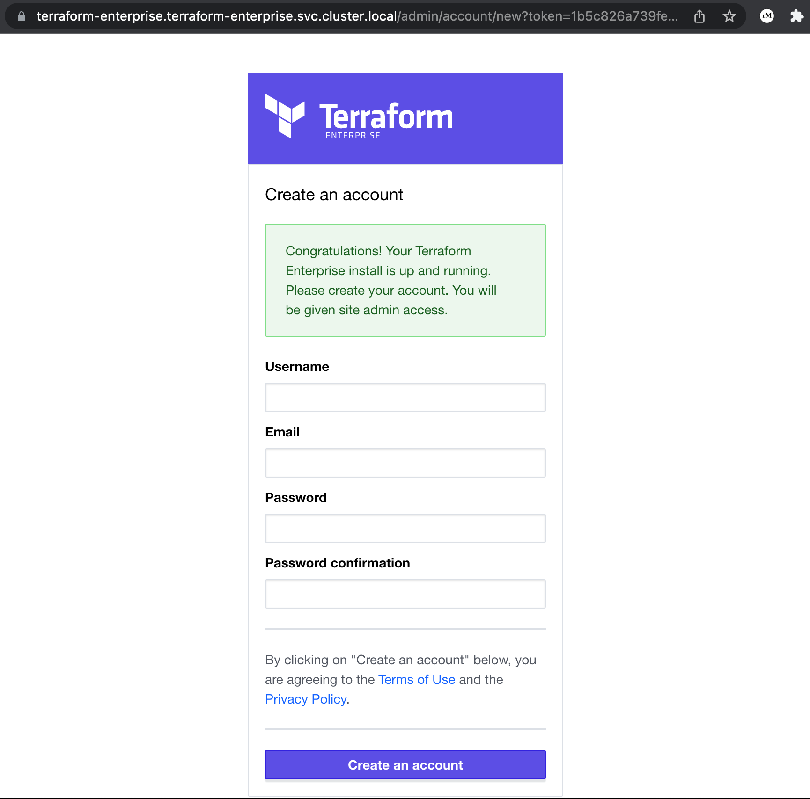

# Terraform Enterprise

This chart is used to install Terraform Enterprise in a generic Kubernetes environment. It is minimal in its configuration and contains the basic things necessary to launch Terraform Enterprise on a Kubernetes cluster.

## Prerequisites

To use the charts here, [Helm](https://helm.sh/) must be configured for your
Kubernetes cluster. Setting up Kubernetes and Helm are outside the scope of
this README. Please refer to the Kubernetes and Helm documentation.

The versions required are:

  * **Helm 3.0+** - This is the earliest version of Helm tested. It is possible
    it works with earlier versions but this chart is untested for those versions.
  * **Kubernetes 1.25+** - This is the earliest version of Kubernetes tested.
    It is possible that this chart works with earlier versions but it is
    untested.

## Instructions

Complete documentation and instructions for the installation of Terraform Enterprise can be found on the [Terraform Enterprise developer site](https://developer.hashicorp.com/terraform/enterprise/flexible-deployments/install).

## Helpful Commands
There are a number of common helm or kubectl commands you can use to monitor the installation and the runtime of Terraform Enterprise. We list some of them here. We assume that the namespace is `terraform-enterprise`. If you have a different namespace, replace it with yours.

* To see releases:
  ```sh
  helm list -n terraform-enterprise
  ```

* To check the status of the Terraform Enterprise pod:
  ```sh
    kubectl get pod -n terraform-enterprise
  ```
  In the output, the `STATUS` should be in `Running` state and the `READY`section should show `1/1`. e.g:
  ```sh
  NAME                                   READY   STATUS    RESTARTS   AGE
  terraform-enterprise-5946d99fc-l22s9   1/1     Running   0          25m
  ```
  If this is not the case, you can use the following steps to debug:
* Check pod logs:
  ```sh
  kubectl logs terraform-enterprise-5946d99fc-l22s9
  ```
* To diagnose issues with the terraform-enterprise deployment such as image pull errors, run the following command:
  ```sh
  kubectl describe deployments -n terraform-enterprise
  ```
* Exec into the pod if possible:
  ```sh
  kubectl exec -it terraform-enterprise-5946d99fc-l22s9 -- /bin/bash
  ```
* In the Terraform Enterprise pod, run:
  ```sh
  supervisorctl status
  ```
  This should show you which service failed. From outside the pod you can also do this:
  ```sh
  kubectl exec -it terraform-enterprise-5946d99fc-l22s9 -- supervisorctl status
  ```

* All Terraform Enterprise services logs can be found in the pod here `/var/log/terraform-enterprise/`. E.g:
  ```sh
  cat /var/log/terraform-enterprise/atlas.log
  ```
  From outside the pod, this will be:
    ```sh
    kubectl exec -it terraform-enterprise-5946d99fc-l22s9 -- cat /var/log/terraform-enterprise/atlas.log
    ```

## Bootstrap Terraform Enterprise

### Establish DNS

Once Terraform Enterprise has loaded and passed all startup health checks you should take the following actions, the details of which are particular to your environment:

* Expose the terraform-enterprise load balancer service to network access from your workstation
* Establish a DNS address or a host file entry for the Terraform Enterprise load balancer public ip address and hostname
* Install the CA certificate for your instance certificate on your workstation if necessary
* Confirm the above actions by visiting the Terraform Enterprise health check endpoint at `https://<terraform_enterprise_hostname>/_health_check`

### Create an Administrative User

In order to retrieve an _initial admin creation token_ or an iact, visit the `admin/retrieve-iact` url path with a browser or curl from a source ip address within your `TFE_IACT_SUBNETS` range and a time before the limit defined by the `TFE_IACT_TIME_LIMIT` setting.

```shell
curl https://terraform-enterprise.terraform-enterprise.svc.cluster.local/admin/retrieve-iact
> 1b5c826a739fe1e2b91cc5932f7adda204bfefcf4bcbe006ac88831d8d208114
```

Then use this token as a url parameter for the initial admin creation workflow:

`https://terraform-enterprise.terraform-enterprise.svc.cluster.local/admin/account/new?token=1b5c826a739fe1e2b91cc5932f7adda204bfefcf4bcbe006ac88831d8d208114`



Congratulations, you're ready to start using Terraform Enterprise!  Create an organization and get started.

## Additional Documentation

For more information about Terraform Enterprise and the capabilities of this helm chart please see the following additional documentation:

* [Dependency Free Terraform Enterprise Quickstart Guide](docs/quickstart.md#dependency-free-terraform-enterprise-quickstart-guide)
* [Terraform Enterprise Application Configuration Options](docs/configuration.md#terraform-enterprise-application-configuration-options)
* [Examples of Common Implementations](docs/implementations.md#implementation-examples)
* [Terraform Enterprise Common Kubernetes Configuration](docs/kubernetes_configuration.md#terraform-enterprise-common-kubernetes-configuration)
